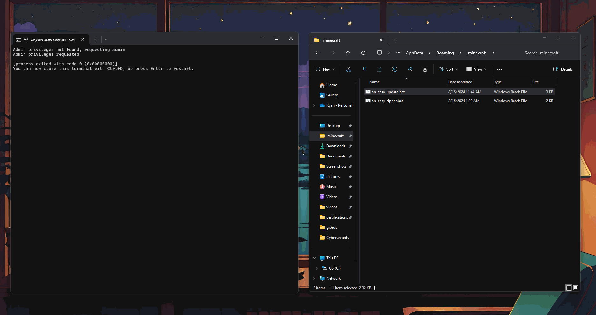
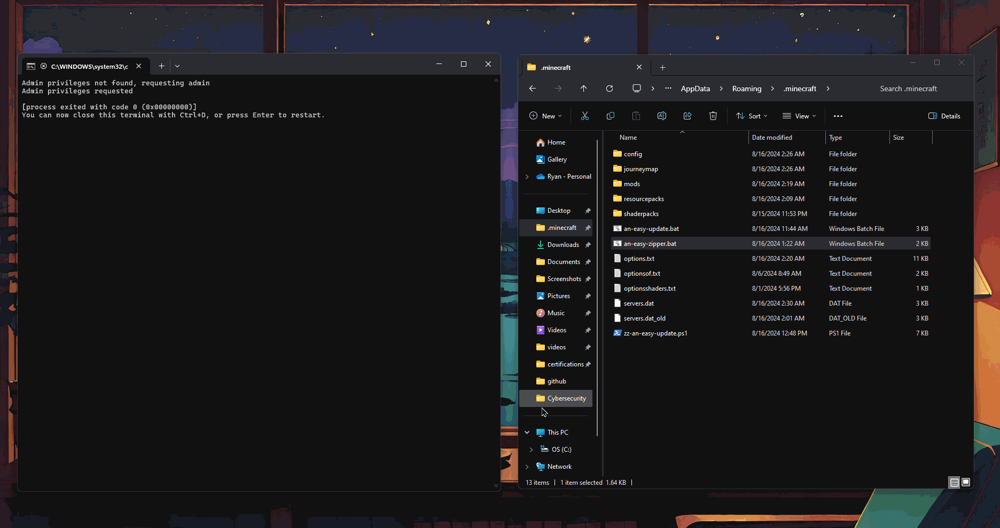

## Demonstration

an-easy-updater.bat


an-easy-zipper.bat


# an-easy-suite
Automated update/zip packaging scripts for a server. Turns hours of packaging, uploading, and managing files into a '1-click' solution.
- Problem: Client needs their users to always use the most up to date files. The client automatically updates the user files on their personal Google Drive.
- Solution: Build an updater to pull the files from Google Drive, extract, and implement them to the users device.

## What I Learned

This project was an opportunity to improve my skills in automation, scripting, and cloud storage management. Through creating this script, I learned:
- **PowerShell Automation**: Writing and debugging scripts that automate repetitive tasks, making life easier for users.
- **Batch Scripting**: Using batch files to handle tasks like downloading files, running scripts, and managing admin privileges.
- **Cloud Integration**: Using Rclone to upload files to Google Drive, allowing for easy cloud storage and sharing.
- **User-Friendly Design**: Creating a simple menu system that guides users through updating their Minecraft setup, even if they aren't tech-savvy.

## Tools Used

- **Windows Batch Scripting**: Used to automate tasks in a Windows environment.
- **PowerShell**: Utilized for more advanced scripting and system management.
- **7-Zip**: Employed for compressing and decompressing files.
- **Rclone**: Used for managing files on cloud storage (Google Drive) from the command line.
- **cURL**: For downloading scripts and files from the web.


## Project Overview

This project involves three main scripts that work together to keep the client's Minecraft installation up-to-date with the latest mods and settings.

1. **`an-easy-update.bat`**: This script:
   - Runs with administrator privileges.
   - Downloads the latest `zz-an-easy-update.ps1` script from GitHub.
   - Runs the PowerShell script to update the Minecraft installation.

2. **`zz-an-easy-update.ps1`**: This PowerShell script:
   - Deletes outdated Minecraft folders and files.
   - Downloads the latest `.minecraft.zip` file from Google Drive.
   - Extracts and replaces the necessary folders and files.
   - Offers users a choice between a full update or just updating the `mods` folder.

3. **`an-easy-zipper.bat`**: This script:
   - Compresses key Minecraft folders into a `.zip` file.
   - Uploads the `.zip` file to Google Drive using Rclone.

## Prerequisites

Before you start, make sure you have these installed:
- **Python**: Needed for the `gdown` module to download files.
- **PIP**: To install Python packages.
- **7-Zip**: For extracting `.zip` files.
- **Rclone**: For uploading files to Google Drive.

## How to Use

1. **Run the Initial Batch File**:
   - Double-click `an-easy-update.bat` to start the process.
   - The script will request admin privileges and download the latest PowerShell script from GitHub.
   - It then runs the PowerShell script to update your Minecraft setup.

2. **Choose Your Update Option**:
   - The PowerShell script will give you two options:
     - **Full Update**: Deletes and replaces all key folders and files.
     - **Mods Only**: Just updates the `mods` folder.

3. **Upload New Files**:
   - After making changes, run `an-easy-zipper.bat` to automatically compress all updated folders and upload them to Google Drive.

### Example

Run the update script
```shell
an-easy-update.bat
```
Zip and upload the latest files
```shell
an-easy-zipper.bat
```
## Project Challenges and Solutions
1. Challenge: Handling admin privileges and secure downloads.
- Solution: I used batch scripting to ensure the script runs with admin rights and downloads the latest files securely.
2. Challenge: Making the script simple for non-tech users.
- Solution: I created a basic menu system and clear prompts to guide users through the update process.
## Conclusion
This project showcases my ability to automate processes, manage cloud storage, and create user-friendly scripts. It’s a practical example of how I can take a repetitive task and streamline it into an easy-to-use solution.

## Next Steps
I'm eager to continue improving my automation skills and exploring more advanced scripting techniques. This project has fueled my passion for making technology accessible and efficient, and I look forward to applying these skills in future challenges.

Contact
If you have any questions or would like to connect, feel free to reach out. I'm always open to feedback and new opportunities.

